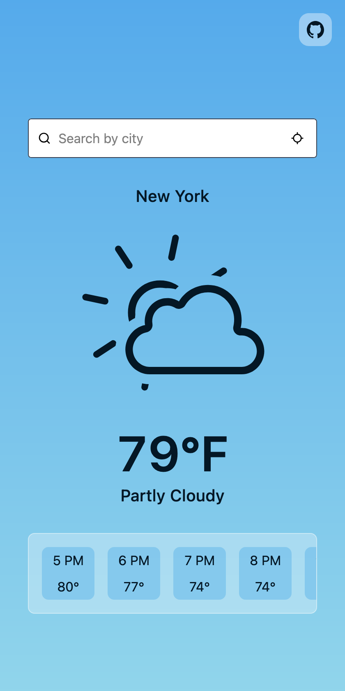
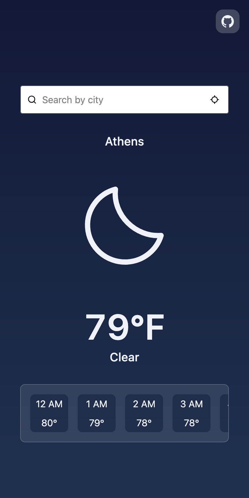

<table align="center" width="800">
  <tr>
    <td align="left"></td>
    <td width="40"></td>
    <td align="right"></td>
  </tr>
</table>

# Weather App

A weather app that uses geolocation or city name to show current conditions and a scrollable 24-hour forecast.

Built with **React** and **TypeScript**, styled using **Tailwind CSS v4**, bundled via **Vite**, and powered by the **Open-Meteo API**. Weather icons are derived from **[Meteocons](https://github.com/basmilius/meteocons)** by Bas Milius, used under the MIT License. The copies in `src/assets/icons/` are modified.

Try it at [weather.leslieledeboer.com](https://weather.leslieledeboer.com)